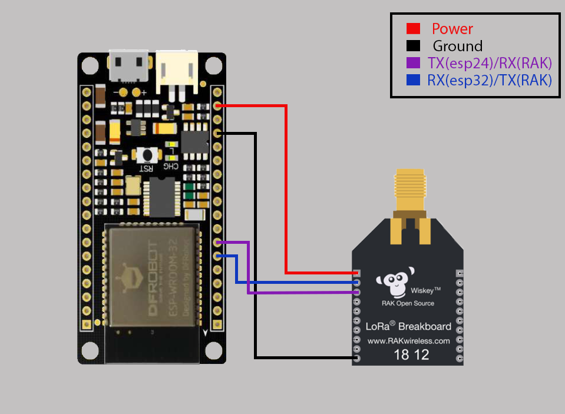

# Firebeetle ESP32 LoRaWAN with RAK811

The Firebeetle ESP32, together with the RAK811, joining, sending, and receiving downlink(Only **int** implemented; for downlinks).  
Set the **DevEUI**, **AppEUI**, and **AppKey**  in `config.py`

For AT commands, error codes, and RAK811 information, see the [RAK811 Breakout Board AT Command Manual.](https://docs.rakwireless.com/Product-Categories/WisDuo/RAK811-Breakout-Board/AT-Command-Manual/#introduction)

The default setting is connected to UART1 on the Firebeetle ESP32, and the UART response timeout is set to 5 seconds. 

